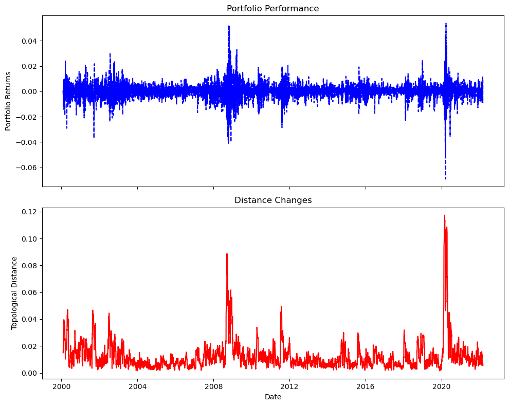

<div align="center">
    <a href="https://unsplash.com/@alterego_swiss?utm_content=creditCopyText&utm_medium=referral&utm_source=unsplash">
    <p>
        
    </p>
</a>
<h2 align="center">Finance TDA</h4>
<h4 align="center">Topological Tail Dependence: Evidence from Forecasting Realized Volatility</h4>
<h5 align="center">[v-2024.2.1]</h5>

[](https://media1.giphy.com/media/hpddP09Trx1AwSVlgm/giphy.gif?cid=ecf05e47uwg39vrpmksf5f73kcmi8iuy11r9p2l3540j8jfo&ep=v1_gifs_search&rid=giphy.gif&ct=g)
[](https://media2.giphy.com/media/q2b0xsUuQFGHDoUVFB/giphy.gif?cid=ecf05e47fb1zlbo33kivfd73z4yzdn97ej6tagfeyacvfojo&ep=v1_gifs_search&rid=giphy.gif&ct=g)

<a href="https://www.buymeacoffee.com/ibaris" target="_blank"></a>

<p align="center">
  <a href="#introduction">Introduction</a> •
  <a href="#installation">Installation</a> •
  <a href="#Documentation">Documentation</a> •
  <a href="#example">Example</a> •
  <a href="#reference">Reference</a>
</p>
</div>

# Introduction

This repository hosts the Python package developed from the research presented in the paper ["Topological Tail Dependence: Evidence from Forecasting Realized Volatility"](https://doi.org/10.1016/j.jfds.2023.100107) and [repositoy](https://github.com/hugogobato/Topological-Tail-Dependence-Evidence-from-Forecasting-Realized-Volatility) by Hugo Gobato Souto. The package is designed to implement the methodologies and techniques described in the paper, focusing on the application of topological data analysis to understand tail dependence in financial markets.

The core of this package lies in its ability to model and forecast realized volatility in financial markets through the lens of topological data analysis. It presents a novel approach to understanding the complex relationships in financial data, especially during periods of high volatility or market stress.

# Installation

```cmd
> pip install fintda
```

You can also install the stable version with

```cmd

>>> pip install https://github.com/ibaris/finance-tda/archive/main.zip

```

To install the in-development version, change the branch name main to the other available branch names.

# Documentation

The documentation `code` documentation is in `build/docs`.

# Example

## Setup and Data Retrieval

Import Libraries: Import necessary libraries, including numpy, yfinance, and modules from the FinTDA package.

```python
import numpy as np
import yfinance as yf
from fintda import FinTDA
from fintda.auxiliary import get_data_range
%matplotlib inline
```

Define Financial Indexes and Date Range: Select the financial indexes and the date range for analysis.

```python
index_names = ['^GSPC', '^DJI', '^RUT']  # S&P 500, Dow Jones, Russell 2000
start_date_string = "2000-01-01"
end_date_string = "2022-03-30"
```

Retrieve Data from Yahoo Finance: Use yfinance to download historical data for the specified indexes and date range.

```python
raw_data = yf.download(index_names, start=start_date_string, end=end_date_string)
```

```console
[*********************100%%**********************]  3 of 3 completed
```

Data Preprocessing: Focus on adjusted closing prices and compute logarithmic returns.

```python
df_close = raw_data['Adj Close'].dropna(axis='rows')
returns = np.log(df_close.pct_change() + 1)
returns.dropna(inplace=True)
```

## Financial Time Series Analysis with FinTDA

Initialize FinTDA: Create an instance of FinTDA with the processed returns and predefined weights.

```python
weights = np.array([0.5, 0.3, 0.2])  # Define portfolio weights
ftda = FinTDA(returns, weights, log_returns=False)
```

```console
Rips(maxdim=2, thresh=inf, coeff=2, do_cocycles=False, n_perm = None, verbose=True)
```

Compute Moving Persistence Diagrams: Use the compute_moving_dgm method to calculate persistence diagrams. This method is essential for analyzing the topological features of the financial time series data.

```python
distance = ftda.compute_moving_dgm(plot=True)
```

```console
Computing Moving Diagrams: 100%|██████████| 5556/5556 [00:09<00:00, 580.01it/s]
```



# Reference

The development of this package is based on the research published in the following paper:

Souto, H.G. (2023). Topological Tail Dependence: Evidence from Forecasting Realized Volatility. The Journal of Finance and Data Science, 9. DOI: [10.1016/j.jfds.2023.100107](https://doi.org/10.1016/j.jfds.2023.10010)

The initial implementation from `hugogobato` can be found at:
[Topological Tail-Dependence Evidence](https://github.com/hugogobato/Topological-Tail-Dependence-Evidence-from-Forecasting-Realized-Volatility?tab=readme-ov-file)
